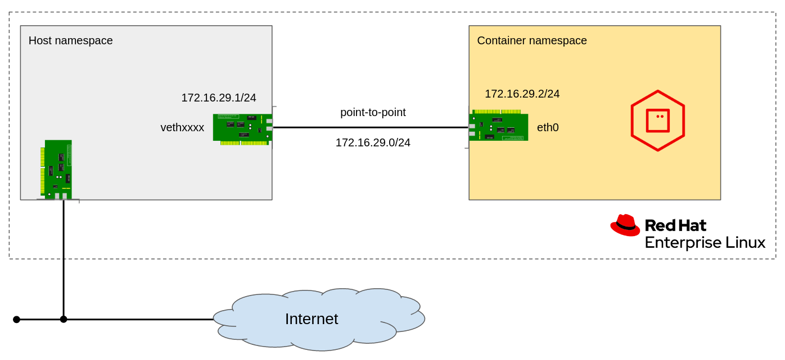
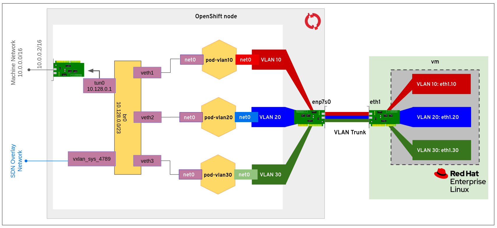

# Container Network Interface demo

This demo is based on [demo.sh](https://github.com/pbertera/demo.sh) and demonstrates 2 scenarios:

## CNI Demo

The `cni.sh` runs a demo installing [CNI plugins](https://github.com/containernetworking/plugins) and [cnitool](https://github.com/containernetworking/cni/tree/master/cnitool), creating a network namespace and setting up a ptp network between the netns and the host.

## OpenShift Demo

The `openshift.sh` runs a demo on OpenShift

### Requirements

- One or more cluster nodes with an additional network interface connected to a VLAN Trunk
- An external VM or host connected to the VLAN Trunk
- NMState Operator installed on the cluster

The demo does the following:

1. Creates the VLAN interfaces for VLAN ids: 10, 20, 30 on the external VM
2. Creates the VLAN interfaces on the OCP nodes using NMState `NodeNetworkConfigurationPolicy`. Nodes are selected with the labels
    - `vlan10: yes` for VLAN 10
    - `vlan20: yes` for VLAN 20
    - `vlan30: yes` for VLAN 30
3. Configure the cluster network operator in order to create 3 additional networks, one per each VLAN. IPAM is managed with the `whereabouts` plugin
4. Attach three dummy pods to the networks and check the connectivity

